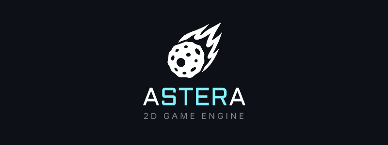

# Astera

Astera is a cross-platform, 2D game engine written in C++. It uses OpenGL for rendering, Lua for
scripting, and an Entity Component System for scene management.

The bulk of the engine's API is exposed to Lua and available to scripts. Here's an example script
from the
Sandbox demo project:

```lua
--- Behavior: BallController.lua
--- Created by Astera
---

ballSpeed = 500
bgMusicID = 1

---@param this Entity
function OnAwake(this)
    Log:Debug(string.format("OnAwake() called for entity: %s", this.name))

    if AudioPlayer:IsInitialized() then
        AudioPlayer:SetSoundVolume(bgMusicID, 0.5)
        AudioPlayer:PlaySound(bgMusicID, true)
    end
end

---Handle movement of ball sprite based on input
---@param transform Transform
---@param dT number
function HandleMovement(transform, dT)
    local newPosition = Vec2(0, 0)

    -- Check is one of our movement keys is pressed
    if Input:GetKeyDown(KeyCode.W) then
        -- Apply a new value to the correct axis scaled by delta time
        newPosition.y = (ballSpeed * dT)
    end
    if Input:GetKeyDown(KeyCode.S) then
        newPosition.y = -(ballSpeed * dT)
    end
    if Input:GetKeyDown(KeyCode.A) then
        newPosition.x = -(ballSpeed * dT)
    end
    if Input:GetKeyDown(KeyCode.D) then
        newPosition.x = (ballSpeed * dT)
    end

    -- Translate our entity by the corresponding new amount
    transform:Translate(newPosition)
end

---@param this Entity
---@param clock Clock
function OnUpdate(this, clock)
    HandleMovement(this.transform, clock:GetDeltaTime())
end

---@param this Entity
function OnDestroyed(this)
    Log:Debug(string.format("OnDestroyed() called for entity: %s", this.name))
end

```

The Lua API is fully typed and documented (stubs can be found
in [EngineContent/Scripts/types](EngineContent/Scripts/types)).

Astera uses XML to describe scenes and currently only supports loading content in original
authored form (no packing or compression yet).

Sandbox demo scene:

```xml
<?xml version="1.0" encoding="UTF-8" ?>
<Scene name="Sandbox">
    <Entities>
        <Entity id="0" name="Ball">
            <Components>
                <Transform>
                    <Position x="640" y="360"/>
                    <Rotation x="0" y="0"/>
                    <Scale x="64" y="64"/>
                </Transform>
                <SpriteRenderer>
                    <Texture>ball.png</Texture>
                </SpriteRenderer>
                <Behavior>
                    <Script id="0">BallController.lua</Script>
                </Behavior>
                <Rigidbody2D>
                    <BodyType>Dynamic</BodyType>
                    <Velocity x="0.0" y="0.0"/>
                    <Acceleration x="0.0" y="0.0"/>
                    <Force x="0.0" y="0.0"/>
                    <AngularVelocity>0.0</AngularVelocity>
                    <AngularAcceleration>0.0</AngularAcceleration>
                    <Torque>0.0</Torque>
                    <Mass>1.0</Mass>
                    <InverseMass>1.0</InverseMass>
                    <Inertia>1.0</Inertia>
                    <InverseInertia>1.0</InverseInertia>
                    <Restitution>0.5</Restitution>
                    <Friction>0.3</Friction>
                    <LinearDamping>0.01</LinearDamping>
                    <AngularDamping>0.01</AngularDamping>
                    <GravityScale>1.0</GravityScale>
                    <LockRotation>false</LockRotation>
                </Rigidbody2D>
            </Components>
        </Entity>
    </Entities>
</Scene>
```

This is an ongoing project and is provided as-is. Issue reports are welcome but likely to be ignored
until Astera is "officially" released.